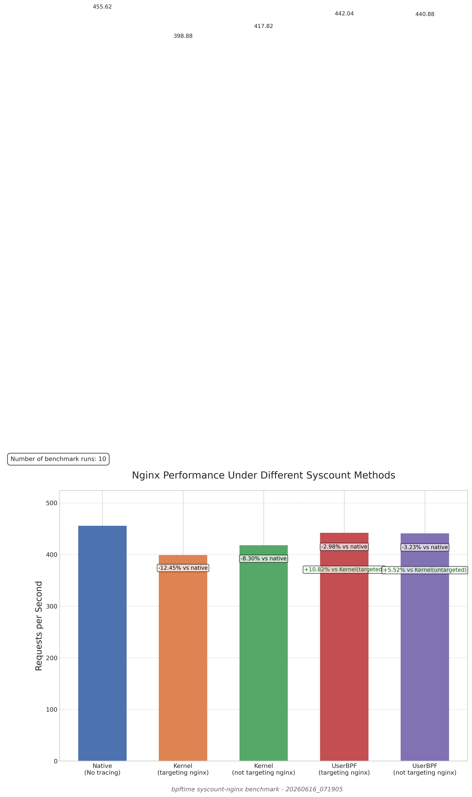

# Benchmark Report: syscount-nginx Performance Analysis

## Overview
This report analyzes the performance of nginx under different syscall counting methods, comparing native execution (no tracing), kernel-based syscount (both targeted and untargeted), and bpftime's userspace BPF implementation (both targeted and untargeted).

## Test Environment
- **Test Date**: 2026-06-16
- **Benchmark Tool**: wrk (`http://127.0.0.1:801/index.html`, concurrency: 100, duration: 10s)
- **Number of Runs**: 10

## Performance Results

| Configuration | Requests/sec | % vs Native | % vs Kernel (same targeting) |
|---------------|--------------|-------------|------------------------------|
| Native (No tracing) | 455.62 | - | - |
| Kernel syscount (targeting nginx) | 398.88 | -12.45% | - |
| Kernel syscount (not targeting nginx) | 417.82 | -8.30% | - |
| UserBPF syscount (targeting nginx) | 442.04 | -2.98% | +10.82% |
| UserBPF syscount (not targeting nginx) | 440.88 | -3.23% | +5.52% |

## Key Findings

1. **Performance Comparison with Native Baseline**
   - There's a mixed performance impact when comparing with the native baseline.

2. **UserBPF vs Kernel-based syscount**
   - When targeting nginx specifically, UserBPF showed 10.82% better performance than the kernel equivalent.
   - When not targeting nginx, UserBPF showed 5.52% better performance than the kernel equivalent.

3. **Targeted vs. Untargeted Performance**
   - For kernel-based tracing, the untargeted mode performed 4.75% better than targeted mode.
   - For UserBPF, the targeted mode performed 0.26% better than untargeted mode.

## Conclusion

The benchmark results demonstrate that bpftime's userspace BPF implementation provides performance characteristics that differ from traditional kernel-based syscount for syscall tracing.

This data suggests that userspace BPF may offer benefits for observability tools that need to monitor production systems with minimal overhead.

## Recommendations

1. **Extend testing with more runs**: Multiple benchmark runs with different loads would provide more statistical confidence.

2. **Profile resource usage**: Adding CPU, memory, and I/O metrics would provide deeper insights into the efficiency differences.

3. **Test with varied workloads**: Different nginx configurations and request patterns could reveal performance characteristics under various conditions.

## Raw Data

The raw benchmark data is available in the JSON file: `benchmark_results_20260616_071905.json`

